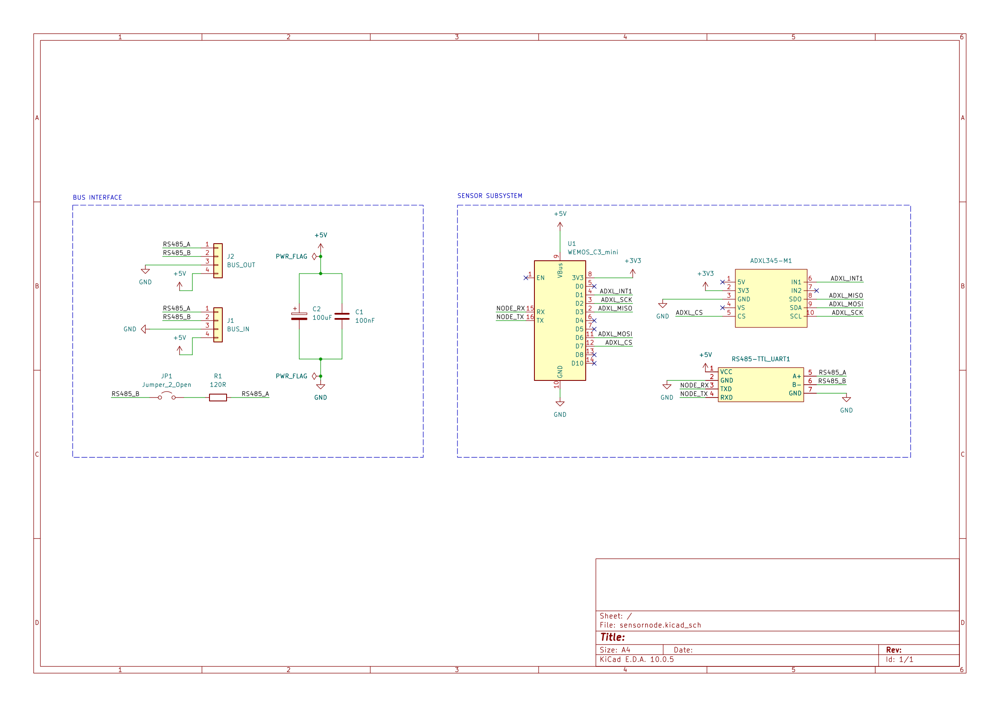
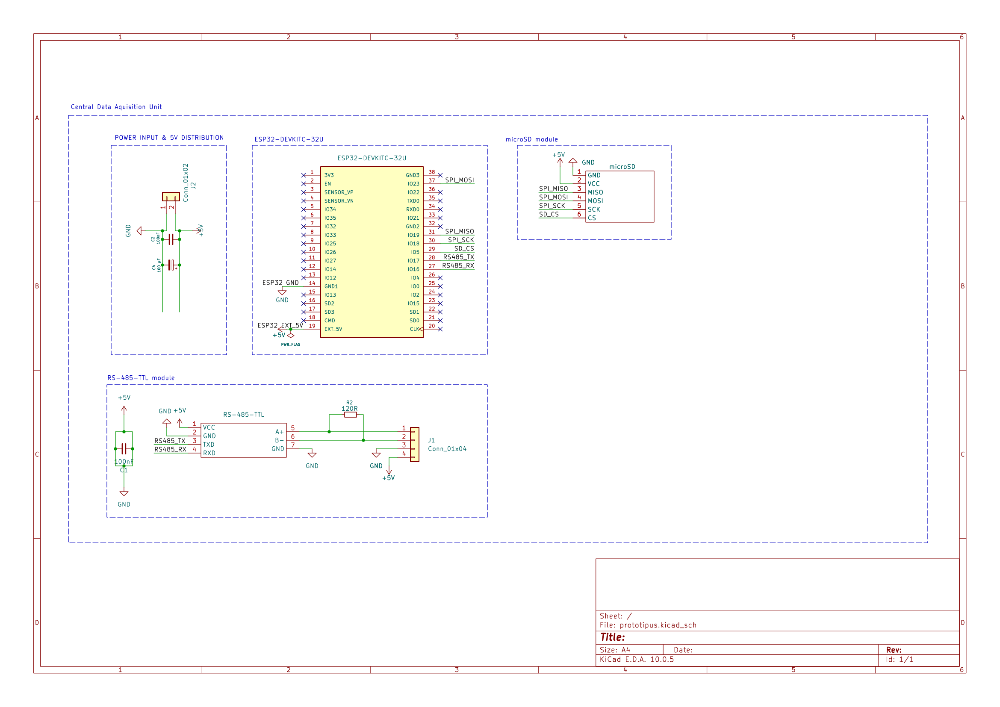

# Distributed Vehicle Vibration Data Acquisition System

A low-cost, multi-point MEMS sensor system for analyzing and monitoring vibration behaviour in passenger vehicles.

**Key Question:** *Can low-cost MEMS accelerometers provide useful vibration telemetry across distributed measurement points on a vehicle?*

The project currently focuses on the sensor network and hardware design. 
The system is being developed in KiCad, with C/C++ firmware and Python-based data analysis planned for later stages.

## Tech Stack

* **EDA / Hardware:** KiCad 8
* **Processing:** ESP32-C3 Mini (32-bit RISC-V)
* **Sensing:** ADXL345 (3-axis MEMS, hardware SPI + INT1 data-ready interrupt)
* **Bus / Physical Layer:** RS-485 transceiver (UART), daisy-chain topology with switchable 120 Ω termination
* **Central Unit (Planned):** Dedicated Central Data Acquisition Unit (CDU) PCB
* **Firmware (Planned):** C / C++ (SPI DMA/FIFO, multi-node packet protocol)
* **Analytics & Edge AI (Planned):** Python (NumPy, SciPy for FFT) & TinyML anomaly detection

## Project Status & Roadmap

---
### Completed (Current Stage)
- [x] Distributed system architecture and multi-drop (daisy-chain) bus concept
- [x] Sensor node schematic capture in KiCad (SPI, UART-RS485, power decoupling)
- [x] Electrical Rules Check (ERC) verified

---
### Next Steps 
- [ ] Central Data Acquisition Unit (CDU) PCB design and prototyping
- [ ] Sensor node firmware development (C/C++, SPI DMA/FIFO, RS-485 packet protocol)
- [ ] Multi-point road testing on passenger vehicle
- [ ] Python vibration analysis pipeline (FFT, time/frequency domain feature extraction)
- [ ] Potential ML / TinyML integration for vibration anomaly detection (feasibility study)

---
## Schematics & Hardware Preview

### Sensor Node

> 📄 [Download Sensor Node Schematic (PDF)](docs/schematics/sensornode.pdf)

### Central Data Acquisition Unit (CDU)

> 📄 [Download Central Unit Schematic (PDF)](docs/schematics/cdu.pdf)

